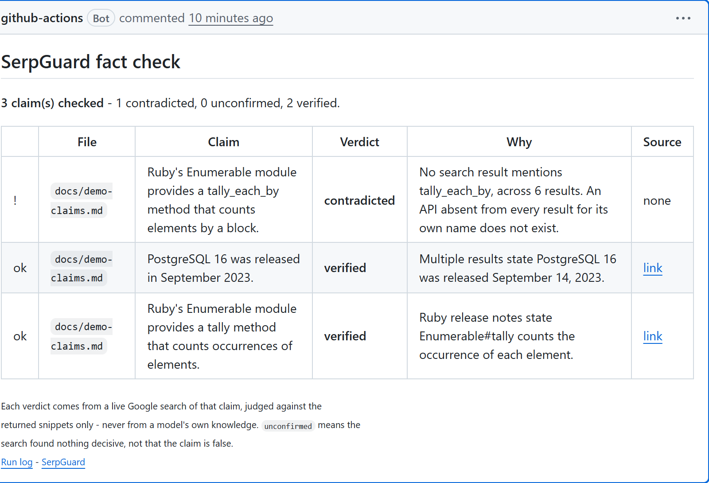

# SerpGuard

[](https://github.com/Divyanshu-2907/SerpGuard/actions/workflows/ci.yml)

**Fact-checks AI-generated text and code against live search results.**

For developers about to commit AI-written code or docs: it catches the version number, method name
or figure a model stated confidently and got wrong, before it reaches a codebase or a reader who
will believe it.

Built for the SerpApi India Hackathon 2026 — AI Agents track.

**Live:** <https://serpguard.onrender.com> · **In your repo:**
[a GitHub Action for pull requests](#use-it-in-your-repo)

---

## Try it right now

Open <https://serpguard.onrender.com> and press **Verify Claims**, or call it directly:

```sh
curl -X POST https://serpguard.onrender.com/api/v1/checks \
  -H 'content-type: application/json' \
  -H 'X-API-Key: demo-key' \
  -d '{"text":"The Eiffel Tower is located in London."}'
```

```sh
curl https://serpguard.onrender.com/api/v1/health     # liveness, no key needed
curl https://serpguard.onrender.com/api/v1            # service description as JSON
curl -X POST https://serpguard.onrender.com/api/v1/checks -d '{"text":"x"}'   # 401, no key
```

> **The free instance sleeps after 15 minutes of inactivity**, so the first request may take up to a
> minute. An unseen claim then takes 10-20 seconds — it is two Claude calls and a live Google search
> per claim. Send the same text twice and the claims usually come back `cached: true` in a second or
> two, having made no upstream calls - "usually" because the cache matches claim text, and extraction
> can word the same claim differently on a re-run.

---

## Use it in your repo

A composite action that checks the Markdown files a pull request changes and leaves one comment
with the verdicts. Add this workflow:

```yaml
name: Fact check

on: pull_request

permissions:
  contents: read
  pull-requests: write

jobs:
  serpguard:
    runs-on: ubuntu-latest
    steps:
      - uses: actions/checkout@v4
        with:
          fetch-depth: 0          # the action diffs base against head

      - uses: Divyanshu-2907/SerpGuard@v1
        with:
          api-key: ${{ secrets.SERPGUARD_API_KEY }}
```



*A real run — [pull request #4](https://github.com/Divyanshu-2907/SerpGuard/pull/4) in this
repository, checking three claims in one Markdown file. The invented `tally_each_by` is the
contradicted row; the two real ones carry the source that settled them.*

**The secret.** Create `SERPGUARD_API_KEY` under *Settings → Secrets and variables → Actions → New
repository secret* in the repo running the workflow. Point `api-url` at your own deployment and use
your own key; `demo-key` on the public instance is shared and rate-limited, and is there for trying
the API by hand rather than for CI.

| Input | Default | What it does |
| ----- | ------- | ------------ |
| `api-key` | *required* | Your SerpGuard key. Masked in the log — pass a secret, never a literal |
| `api-url` | `https://serpguard.onrender.com` | Your deployment |
| `paths` | `*.md` | Space-separated globs; matched against the whole path |
| `max-files` | `3` | Files per run |
| `max-chars` | `5000` | Characters sent per file |
| `fail-on-contradicted` | `false` | Comment only by default |

**It costs money per run**, which is what `max-files` and `max-chars` are for: each file is two
Claude calls plus at least one paid Google search per claim found in it. Start small.

What it does and does not do:

- One comment per pull request, edited in place on later pushes rather than piling up — it finds its
  previous comment by a hidden marker.
- Contradicted claims are listed first; `unconfirmed` means the search found nothing decisive, not
  that the claim is false.
- Deleted files are skipped, and so are files past `max-files`, with a note saying so.
- A pull request **from a fork** gets no secrets from GitHub, so there is nothing to check with. The
  run says so and succeeds rather than failing red.
- A bad key fails the job loudly (401); a rate limit, a timeout or a sleeping free instance skips
  that file with a note and carries on.

Outputs `checked`, `contradicted`, `unconfirmed` and `verified` if you want to gate on them
yourself.

---

## What it does, and why

Language models produce claims that read exactly like facts whether or not they are: a version
number that shipped a year later than stated, a method that does not exist, a statistic that was
true in 2021. SerpGuard takes a block of AI-generated prose or code, uses Claude to pull out the
discrete claims that can actually be checked, runs a real Google search per claim through SerpApi,
and then asks Claude to rule on each claim **against the returned snippets only** — returning
`verified`, `unconfirmed` or `contradicted` with a one-line reason and a source URL taken from the
results themselves. The point is that a second model reading its own training data cannot catch a
stale fact; a live search can. Where Google answers the query itself — an answer box or a knowledge
graph panel — that answer is weighed ahead of the ordinary results, and a claim that only holds
*right now* is searched inside the past year. Verdicts are cached per claim, so a claim that comes
back in the same words costs nothing the second time.

```
POST /api/v1/checks   { "text": "Rails 8 was released in March 2023." }
  →  contradicted · "The Rails blog dates the 8.0 release to November 2024."
     source: https://rubyonrails.org/2024/11/7/rails-8-no-paas-required
```

There is a browser demo at `GET /` and a JSON service description at `GET /api/v1`.

## Stack

Rails 8.1 (API-only) · Ruby 3.3 · MongoDB via Mongoid · HTTParty · Rack::Attack · RSpec + WebMock ·
287 specs, no live network calls

---

## How accurate is it?

Measured, not asserted. `eval/claims.yml` holds 25 claims with a known answer, every label checked
against a source URL recorded next to it. The benchmark runs outside RSpec because it spends real
Claude and SerpApi calls; the test suite stays offline.

**Run of 1 October 2026** — 25 claims, local server, empty cache, 38 SerpApi searches.

| | Count | |
| -- | ----- | -- |
| Correct | **18 / 25** | the verdict matched the label |
| Abstained | **7** | answered `unconfirmed` — the search found nothing decisive |
| Wrong | **0** | no confident verdict disagreed with a label |
|  false `verified` | 0 | never called a false claim true |
|  false `contradicted` | 0 | never called a true claim false |

| Category | n | Correct | Abstained | Wrong |
| -------- | - | ------- | --------- | ----- |
| True facts | 6 | 6 | 0 | 0 |
| False facts | 6 | 6 | 0 | 0 |
| Real methods | 5 | 4 | 1 | 0 |
| Invented methods | 5 | **0** | 5 | 0 |
| Time-sensitive | 3 | 2 | 1 | 0 |

Average 30.4s per uncached claim, slowest 109.6s. One SerpApi read timeout retried and recovered.

The honest reading: on this dataset SerpGuard never stated a wrong verdict, and it got every plain
fact right in both directions. It abstained on 7 of 25, and the abstentions are concentrated in the
one place that matters most — the hallucinated-API catch scored **0 of 5**.

### The misses

**1. Every invented method came back `unconfirmed` instead of `contradicted`** (`im-01` … `im-05`).
Each was typed `code_api` and reached the escalation, and none of them fired. Three different
reasons, and only the first is the system being right:

- `compact_sum` and `transform_pairs` are *mentioned* on the web — both are open Ruby feature
  requests on bugs.ruby-lang.org. The name appears in the results, so the escalation correctly held
  off, and `unconfirmed` with a link to the proposal is a fair answer.
- `find_or_fail_by` lost to its own namespace. The claim names `ActiveRecord::Relation`, and
  `#code_identifiers` adds the trailing segment `Relation` as a term to look for; Rails
  documentation pages obviously contain the word "Relation", so the evidence counted as covering
  the claim even though `find_or_fail_by` appeared nowhere in it.
- `mapUnique` is invisible to the identifier scanner. `CODE_IDENTIFIER_PATTERN` matches
  `Foo::Bar`-style constants and `snake_case` names; it does not match camelCase, nor
  `Array.prototype`. With no identifier found, neither the context-only retry nor the escalation can
  fire, so a JavaScript-style name is never checked for absence at all.

**2. A real method missed because the claim was specific about where it lives** (`rm-03`).
"ActiveRecord::Relation in Rails provides a find_or_create_by method" came back `unconfirmed`:
*"Snippets confirm find_or_create_by exists in Rails but none state it is provided by
ActiveRecord::Relation specifically."* The verdict is a correct reading of the snippets — the
evidence showed the method, not the class that defines it — so this is the judging prompt being
strict about a detail the search never surfaced.

**3. The current Rails major version could not be sourced** (`ts-02`). "The current major version of
Ruby on Rails is 6" returned off-topic results and `unconfirmed`, while the two other
time-sensitive claims (Python 3.9, Microsoft's CEO) were both correctly `contradicted`. Nothing in
the returned snippets stated a current major version, and the verifier will not fill that in from
the model's own knowledge.

None of these were tuned away. The numbers above are the first and only run of this dataset.

### After fixing two bugs the benchmark found

The run above exposed two defects in the absence test, both fixed, then the **10 code claims only**
were run again on the same day. 14 searches.

| Category | n | Correct | Abstained | Wrong |
| -------- | - | ------- | --------- | ----- |
| Real methods | 5 | **5** (was 4) | 0 | 0 |
| Invented methods | 5 | **3** (was 0) | 2 | 0 |

What changed in the code:

- **A namespace no longer shields an invented method.** The absence test looked for every
  identifier in the claim and counted any one of them turning up as a mention — so `Relation`,
  derived from `ActiveRecord::Relation`, stood in for `find_or_fail_by`, because Rails
  documentation says "Relation" on every page. Probes are now the most specific part of each name,
  kept only when it has an identifier's shape (an underscore or an internal capital). `Relation`,
  `prototype` and `sort` are ordinary words and are dropped.
- **camelCase and dotted names are recognised.** The identifier pattern matched `Foo::Bar` and
  `snake_case` only, so `mapUnique` was not an identifier at all: no context retry, no absence
  test. It now also matches camelCase and `Array.prototype.findLast`, with each dotted segment
  required to start lowercase so that "U.S. Government" stays out.

`im-03` and `im-04` are now `contradicted`, which is what the fixes were for. Three things about
the rest of the numbers that are worth saying plainly:

- **No real method was called fake.** That is the error this feature must not make, and the
  dangerous direction stayed at zero. `rm-03`, the one real method that abstained in the first run,
  came back `verified` this time off a different page.
- **`im-05` (`dedupe_sorted`) also flipped to `contradicted`, but not because of these fixes.** Its
  first search happened to return nothing this time, which triggered the context-only retry;
  in the first run the same claim's first search returned results, so the retry still carried the
  invented name. Same code path, different luck with Google.
- **`im-01` and `im-02` still abstain, correctly.** `compact_sum` and `transform_pairs` are open
  Ruby feature requests, so the names really do appear on the web and the escalation is right to
  hold off.

**This re-run is less independent than the first.** It uses the same claims that found the bugs, so
it shows the fixes work on the cases that motivated them — not that accuracy improved on claims the
code has never seen. The first run's numbers above are left exactly as they were measured.

### Re-running it

```sh
bin/rails server                     # a server with real API keys
EVAL_CLEAR_CACHE=1 bin/rails eval:run
```

It refuses to run against anything but an empty `serpguard_development`, pauses between claims, and
stops by itself if another claim could take the SerpApi balance under 100 searches — reporting how
far it got. Raw per-claim output, including the reason and source for every verdict, is written to
`eval/results/<date>.json`. `EVAL_BASE_URL` points it elsewhere and `EVAL_LIMIT` shortens the run.

---

## Architecture

Three service objects, each with one job, composed by the third:

| Object | Input → output | Responsibility |
| ------ | -------------- | -------------- |
| `ClaimExtractorService` | text → `[Claim(claim:, type:, time_sensitive:)]` | Asks Claude for the independently checkable claims, each restated to stand alone, typed `fact` / `code_api` / `statistic`, and flagged `time_sensitive` when the claim only holds for now. Validates the JSON that comes back. |
| `ClaimVerifierService` | one claim → `{claim:, verdict:, reason:, source_url:}` | Claude writes a search query → SerpApi runs it → Claude rules on the claim against the snippets. Google's answer box and knowledge graph rank above the organic results, and a time-sensitive claim searches the past year first. Reformulates the query once if the results came back about something else. Validates the verdict. |
| `SerpGuardService` | text → the full report | Extracts once, then per claim prefers a cached verdict over the upstream calls a fresh one costs. Persists new verdicts. |

Below them sit two transports and nothing else:

```
app/services/
  serp_guard_service.rb            orchestrator
  claim_extractor_service.rb       text/code  → typed claims
  claim_verifier_service.rb        one claim  → verdict + reason + source
app/services/serp_guard/
  api_client.rb                    shared timeouts, retry policy, error mapping
  claude_client.rb                 Anthropic Messages API
  serpapi_client.rb                SerpApi Google Search
  errors.rb                        SerpGuard::Errors hierarchy
app/models/claim.rb                verdict cache, unique on claim_hash
app/serializers/                   the POST /checks wire format
app/controllers/concerns/          API key auth + the single error envelope
public/index.html                  browser demo: vanilla JS, no build step
```

### Why the transports are separate and injectable

HTTParty is called in exactly two files. Every service above them takes its client as a keyword
argument (`claude_client:`, `serpapi_client:`, `extractor:`, `verifier:`), defaulting to the real
one and built lazily so that input validation runs before anything touches a credential or a socket.

That buys three specific things:

- **Tests never bill a real API.** The whole suite stubs HTTP at one seam. `WebMock.disable_net_connect!`
  is on globally, so a new code path that tries to reach the network fails the suite instead of
  quietly spending money in CI.
- **The retry policy cannot drift.** Both clients inherit timeouts, the single retry, and the
  status → error mapping from `SerpGuard::ApiClient`. "Same conservative retry policy for every
  upstream call" is a requirement, and shared code is how you guarantee it rather than hope for it.
- **API-shape knowledge stays in one place.** That Claude interleaves thinking blocks with text
  blocks, that SerpApi reports "no results" as an `error` string on an HTTP 200 — each of those
  lives in its own client, not smeared across the services.

### Why a missed query gets one second chance

A query can read perfectly and still miss. A live run generated
`Ruby on Rails initial release year 2004` — which contains "Ruby on Rails" — and Google answered
with a civil rights activist's Instagram, a music video, a raid guide and Ruby-the-language. Drop
one word (`year`) and the same search returns "Hansson first released Rails as open source in July
2004" at position one.

Every component had behaved correctly: the claim was fine, the query was reasonable, and the verdict
step honestly reported that the snippets never mentioned Rails. The claim was simply unverifiable
from those results, so the answer was `unconfirmed` — right about the evidence, wrong about the world.

So the verifier checks whether the results mention any of the claim's distinctive terms — code
identifiers and *multi-word* proper nouns, never single capitalised words, because "Ruby" is exactly
what matched the activist and the raid guide. If a verdict comes back `unconfirmed` **and** the
results never mentioned the subject, the query is reformulated once and re-searched. It fires only on
that path, so the common case costs nothing extra.

The same run cited an Instagram reel for "the Eiffel Tower is in London". The verdict was right and
the citation was useless, so evidence is now ordered by source authority — reference works and
official docs ahead of social and video — before it reaches the model. Ordering only: nothing is
discarded, and a social post still carries a verdict when it is all Google returned.

### Why Google's own answers count as evidence

A SerpApi response is not just `organic_results`. When Google can answer the query itself it returns
an `answer_box`, and for an entity it returns a `knowledge_graph` panel — both on the same search,
at no extra call. For a claim like "the current stable release is X" the answer box often states the
version in one sentence, while the organic results are release-notes pages that bury it.

So both panels are read out of the response the search already paid for, converted into the same
`title` / `snippet` / `link` shape as an organic result, labelled with their origin, and ranked in a
tier above organic before authority ordering runs. The prompt is told which is which and weighs a
direct answer accordingly, while still holding it to the same standard — it has to address the
specific claim, not merely the topic.

Two rules keep this honest:

- **No link, no citation.** An answer box does not always carry a URL, and a knowledge graph panel
  may have no `source.link`. Such an item is still shown to the model as evidence, but it can never
  become `source_url`: the prompt marks it `(none - this item cannot be cited)` and the URL check
  rejects it anyway. A verdict is never attributed to something the reader cannot open.
- **Nothing is displaced.** The evidence window grew from five snippets to six so that both panels,
  when both are present, add to the evidence instead of pushing two organic results out of it.
- **The citation says where it came from.** Each claim carries `source_type` (`answer_box`,
  `knowledge_graph`, `organic`, or null), stored with the verdict and shown as a tag on the demo
  page, so "Google's own answer" is visible rather than implied.

### Why time-sensitive claims search the past year

"Ruby's current stable release is 3.1.4" was true once. The sentence does not change; the world does.
Searched against the whole web it returns pages from every year at once, and nothing in the results
says which one is current.

So the extractor flags each claim:

```json
{ "claim": "Ruby's current stable release is 3.1.4", "type": "fact", "time_sensitive": true }
```

Only an explicit `true` counts. A reply that omits the field, or sends `null` or `"yes"`, is treated
as `false` — the wider search and a verdict that never expires — so a sloppy or older reply degrades
to the previous behaviour rather than to the wrong window.

A flagged claim is searched with SerpApi's `tbs=qdr:y`, Google's past-year filter. Two things can
go wrong with that window, and each buys exactly one unfiltered search of the same query:

- **Too thin to judge from** — fewer than three usable results inside the year.
- **Weak verdict** — the filtered evidence produced `unconfirmed`. This one came from a live run:
  "Ruby's current stable release is 3.1.4" came back `unconfirmed` off past-year results that never
  discussed Ruby releases at all, where the unfiltered search had answered it outright. A narrower
  window is not automatically a better one.

The query itself is written differently too. The query prompt tells the model to drop filler like
"current", "latest" and "as of" — good advice for a dated fact, and exactly wrong here: searching
`"Ruby" stable release` returns a page listing every version ever shipped, while `"Ruby" current
stable release` returns the page that says which one it is. So that one rule is appended per claim,
in both halves, and a rewritten query is written under the same rule as the first.

Whichever widening fires, freshness is pinned off for the rest of the run, and it is exclusive with
the query rewrite — so the three second chances cannot stack, and an uncached claim stays bounded:

| | Common path | Worst case |
| -- | ----------- | ---------- |
| SerpApi searches | 1 | **3** — past-year, one unfiltered search, one rewritten query |
| Claude calls | 2 — query, verdict | **4** — plus a rewritten query and a second verdict |

The verdict for a time-sensitive claim is stored with `expires_at` 7 days out; everything else keeps
a nil `expires_at` and stays cached indefinitely. Expiry is enforced by the cache *query*, not by the
TTL index — Mongo's reaper only sweeps about once a minute, so an expired row is still sitting in the
unique index when the claim comes back. Writes therefore go through `Claim.upsert_verdict!`, which
overwrites that row instead of inserting beside it.

### Why caching is per claim, not per request

The cache key is a SHA256 of the *normalized* claim text (case, whitespace and a trailing full stop
collapsed), unique-indexed in MongoDB — not a hash of the submitted document.

Caching whole requests would almost never hit: nobody pastes byte-identical text twice. Claims
repeat more often, so the same wrong fact about a Rails release date can be paid for once. A cache
hit returns the stored verdict with `cached: true` and makes **zero** upstream calls.

**How narrow the match really is.** The key is the claim text after normalization, and normalization
only collapses case, whitespace and a trailing full stop - it does not understand paraphrase. Two
claims that mean the same thing in different words are two different rows. That bites more than it
sounds like, because extraction is not deterministic: submitting the *same input twice* can produce
"ActiveSupport adds an `Enumerable#sum_each_by` method" one run and "ActiveSupport provides an
Enumerable/Array method `sum_each_by`" the next, and those miss each other. Re-running identical text
often hits, but it is not guaranteed. Making the cache survive rewording needs matching on meaning
rather than bytes - embeddings, or a canonical form from the extractor - and neither is built.

Normalization is deliberately shallow — it collapses formatting noise, not meaning. Nothing more
aggressive (stemming, stop-word removal) is safe here, because a false cache hit is not a slow
answer, it is a **wrong** answer attributed to a source that never said it.

Two honest limits:

- **A repeat request is one Claude call, not zero.** Extraction runs every time; only verdicts are
  cached. Caching extraction per input text is the obvious next win.
- **Only time-sensitive claims expire.** Search results go stale; the facts they establish mostly
  do not, so a verdict with no `expires_at` is kept indefinitely. Claims that only hold for now are
  flagged by the extractor and expire after 7 days (above). The assumption still live is a cached
  `unconfirmed` verdict on a claim that is *not* time-sensitive: those often say more about what
  Google surfaced that minute than about the claim, and they are kept forever.
  `Claim.cached_verdict_for` says so, and says where to change it.

---

## Setup

### 1. Prerequisites

- Ruby 3.3 (`.ruby-version` pins the exact patch)
- A running MongoDB. Locally, either a native install or:
  ```sh
  docker run -d -p 27017:27017 --name serpguard-mongo mongo:7
  ```
- An [Anthropic API key](https://console.anthropic.com/settings/keys) and a
  [SerpApi key](https://serpapi.com/manage-api-key)

### 2. Install and configure

```sh
bundle install
cp .env.example .env     # then fill in the two upstream keys
```

Every variable is documented in [`.env.example`](.env.example). The required four:

| Variable | Purpose |
| -------- | ------- |
| `ANTHROPIC_API_KEY` | Extracts claims and rules on evidence |
| `SERPAPI_KEY` | Runs the Google search behind each claim |
| `SERPGUARD_API_KEYS` | Keys *your* clients send in `X-API-Key`, comma separated. Keep `demo-key` for the browser demo |
| `MONGODB_URI` | Verdict cache. Optional locally, required in production |

Create the unique index — declaring it in the model does not build it:

```sh
bin/rails db:mongoid:create_indexes
```

### 3. Run and test

```sh
bin/rails server                 # then open http://localhost:3000
bundle exec rspec                # 287 examples, needs a local mongod
bundle exec rubocop              # rubocop-rails-omakase
bundle exec rails zeitwerk:check # eager-load check, as production does it
```

The suite makes **no live HTTP calls**: `spec/rails_helper.rb` sets
`WebMock.disable_net_connect!(allow_localhost: false)`, and
[`spec/no_live_network_spec.rb`](spec/no_live_network_spec.rb) fails if that is ever loosened. It
passes with `ANTHROPIC_API_KEY`, `SERPAPI_KEY` and `SERPGUARD_API_KEYS` completely unset. MongoDB is
the one real dependency, and not by choice — the driver uses raw TCP sockets, which WebMock cannot
intercept, so the cache specs talk to a real `serpguard_test` database. A stubbed datastore would not
prove a unique index or a cache hit.

---

## API

| Method | Path | Auth | Notes |
| ------ | ---- | ---- | ----- |
| `GET` | `/` | no | Browser demo page |
| `GET` | `/api/v1` | no | Service description as JSON |
| `GET` | `/api/v1/health` | no | Liveness. Probes no dependency, so it never flaps |
| `POST` | `/api/v1/checks` | yes | Submit text or code, get a per-claim report |
| `GET` | `/up` | no | Rails' own boot check |

### Example

```sh
curl -X POST http://localhost:3000/api/v1/checks \
  -H 'content-type: application/json' \
  -H 'X-API-Key: demo-key' \
  -d '{"text":"Ruby 3.3 shipped YJIT as a production-ready JIT compiler. Rails 8 followed in March 2023.","max_claims":5}'
```

```json
{
  "checked_at": "2026-09-22T09:41:12Z",
  "input_summary": {
    "characters": 89,
    "claims_extracted": 2,
    "cached_claims": 0,
    "verdicts": { "verified": 1, "unconfirmed": 0, "contradicted": 1 }
  },
  "claims": [
    {
      "claim": "Ruby 3.3 shipped YJIT as a production-ready JIT compiler",
      "type": "fact",
      "verdict": "verified",
      "reason": "The Ruby 3.3.0 release announcement lists YJIT as production ready.",
      "source_url": "https://www.ruby-lang.org/en/news/2023/12/25/ruby-3-3-0-released/",
      "source_type": "organic",
      "time_sensitive": false,
      "cached": false,
      "checked_at": "2026-09-22T09:41:12Z"
    },
    {
      "claim": "Rails 8 was released in March 2023",
      "type": "fact",
      "verdict": "contradicted",
      "reason": "The Rails blog dates the 8.0 release to November 2024.",
      "source_url": "https://rubyonrails.org/2024/11/7/rails-8-no-paas-required",
      "source_type": "answer_box",
      "time_sensitive": false,
      "cached": false,
      "checked_at": "2026-09-22T09:41:12Z"
    }
  ]
}
```

Send the same text again and both claims come back `"cached": true` with no upstream calls at all
(when the extraction words them identically - see [Caching](#why-caching-is-per-claim-not-per-request)).

Text with nothing checkable in it is a valid request, not an error. It answers `200`:

```json
{
  "checked_at": "2026-09-30T08:14:02Z",
  "input_summary": { "characters": 39, "claims_extracted": 0, "cached_claims": 0,
                     "verdicts": { "verified": 0, "unconfirmed": 0, "contradicted": 0 } },
  "claims": [],
  "message": "No checkable factual claims found."
}
```

Opinions, preferences, predictions and instructions are skipped on purpose, so a paragraph made only
of those extracts nothing. `message` appears only when `claims` is empty. A reply that could not be
*read* - not JSON, not a list, truncated, or carrying a claim type that does not exist - is a
different thing and still returns `500 claim_extraction_failed`.

`source_type` says which part of the SerpApi payload the cited result came from - `answer_box`,
`knowledge_graph` or `organic` - and is `null` whenever `source_url` is. A reader cannot tell a
knowledge-graph citation from the tenth blue link by looking at the URL, so the response says which
it was.

`time_sensitive` reports whether the claim was treated as one that only holds for now: searched
inside the past year, and cached for 7 days rather than indefinitely.

`max_claims` is optional, clamped to 1–25 — an unseen claim costs two Claude calls and one SerpApi
search on the common path, and at most four and three (see
[the past-year window](#why-time-sensitive-claims-search-the-past-year)), so it is a spend limit as
much as a response-size one. A cached claim costs nothing.

### Verdicts

| Verdict | Means |
| ------- | ----- |
| `verified` | A result states or clearly implies the claim is correct |
| `contradicted` | A result states something incompatible with the claim |
| `unconfirmed` | The results neither support nor refute it — the claim is unsourced, not disproved |

**One deliberate exception, for `code_api` claims only.** If a claim names a method or API and
that name appears in **no** search result — across every query tried — the verdict is
`contradicted`, not `unconfirmed`, with `source_url: null`. A real method name returns *something*
for a search of its own name, so silence is evidence here in a way it is not for an ordinary fact.
The escalation is narrow on purpose: `code_api` claims only, only from `unconfirmed` (a ruling that
came from a snippet is never overridden), and never when the search returned nothing at all — zero
results means the query failed, not that the method is fake.

### Errors

Every failure uses one envelope: `{"error": {"code", "message", "request_id"}}`.

| Situation | Status | `code` |
| --------- | ------ | ------ |
| Missing or blank `text` | 400 | `parameter_missing` |
| Body is not valid JSON | 400 | `malformed_json` |
| Missing / unknown API key | 401 | `api_key_missing` · `api_key_invalid` |
| Bad `max_claims` | 422 | `validation_failed` |
| Text over 50,000 characters | 413 | `payload_too_large` |
| Over 30 checks/minute | 429 | `rate_limited` |
| No checkable claims found | **200** | *not an error* - empty `claims`, plus a `message` |
| Extraction reply unreadable | 500 | `claim_extraction_failed` |
| Verdict could not be read | 500 | `verification_failed` |
| Upstream down after one retry | 500 | `verification_failed` |
| Our credentials rejected | 500 | `configuration_error` |

`rescue_from StandardError` is registered **first** in `ErrorHandling`, because
`ActiveSupport::Rescuable` matches handlers in *reverse* registration order — broadest first, most
specific last. Unknown exceptions re-raise when `Rails.env.local?`, so development and test keep real
backtraces instead of a tidy 500.

---

## Browser demo

`public/index.html` — one file, vanilla JS, no framework and no build step. A textarea, a **Check
Claims** button, and three preset chips that each exercise a different path:

| Chip | Input | Exercises |
| ---- | ----- | --------- |
| `mixed-facts` | Two true claims about Rails and one plainly false one about the Eiffel Tower | Opposite verdicts from one input |
| `code-hallucination` | A snippet using real `String#squish` and invented `Enumerable#sum_each_by` | `code_api` claims, and the escalation path: a name that appears in **no** result becomes `contradicted` rather than merely unsourced. The invented name was picked by searching for it first - `sum_by`, the previous one, exists in Elixir, so Google returned it and the escalation correctly did not fire |
| `outdated-stat` | A Ruby patch release presented as the current stable one | A time-sensitive claim that live results contradict |

Results render one card per claim with a verdict badge (green / yellow / red), the reason and a
clickable source, plus a `cached` tag when the verdict came from MongoDB, a `fresh results` tag
when the claim was searched inside the past-year window, and a `Google answer box` /
`Google knowledge graph` tag when the citation came from one of those panels. A status strip shows HTTP status, response time, claims checked, how many came from
cache, and the verdict tally; raw JSON sits in a collapsed `<details>`. After 2.5s with no response, a
cold-start notice explains that the free instance is waking up.

It prefills a preset but **does not auto-submit** — unlike a read-only search console, every run
spends Claude and SerpApi credits, so the visitor decides when. The chip labels describe their
*input*, never a promised verdict: the verdict comes from whatever Google returns at that moment.

---

## Engineering notes

### 1. Verdicts are graded against live snippets, never the model's own knowledge

The obvious way to build this is to ask Claude "is this claim true?" It would be shorter, cheaper,
and one API call instead of three. It would also be worthless for the failure mode that actually
matters.

A model's knowledge is frozen at its training cutoff, and the claims most likely to be wrong in
AI-generated text are exactly the ones a model is most likely to be confidently wrong about: current
versions, recent releases, "the latest X", a statistic that moved. Asking a model to check another
model's output is two draws from overlapping distributions — when both are wrong, they agree, and the
check returns `verified` with total confidence. That is worse than no check at all, because it
launders a hallucination as a verified fact.

So the verdict prompt is explicitly told to rule against the provided snippets and *not* from its own
knowledge, however confident it is. Claude is used for the two things it is genuinely good at —
deciding what counts as a checkable claim, and judging whether a snippet supports a sentence — while
the *evidence* comes from a live Google search. The search is the source of truth; the model is the
reader.

That choice has teeth elsewhere in the code. A `source_url` is kept only if it matches a result we
actually handed over; a URL the model invented is dropped and logged rather than passed on as a
citation. And when Google returns nothing, the service short-circuits to `unconfirmed` without asking
for a verdict at all — because a verdict with no evidence behind it is exactly the thing this design
exists to avoid.

### 2. A parse failure must never become `unconfirmed`

`unconfirmed` is a finding. It means: we searched, we read the results, and they neither support nor
refute the claim. A user can act on that — it says the claim is unsourced.

An unreadable verdict means something completely different: we do not know. Claude returned
malformed JSON, or a verdict string outside the three allowed values, or a reply truncated at the
token limit. The temptation is to fall back to `unconfirmed`, because it is the "safe" middle value
and the request then always succeeds.

That fallback would be a silent data-corruption bug. Every such failure would be indistinguishable
from a real finding, the endpoint would keep returning 200, and the only symptom would be a slow
drift toward `unconfirmed` that nobody notices — in a product whose entire value is that its output
can be trusted. Worse, it hides the bug: a prompt regression that breaks JSON output 30% of the time
would look like "lots of unsourced claims" rather than an outage.

So `ClaimVerifierService` raises `VerificationFailed` on every unreadable answer and there is no code
path from a parse error to a verdict. The endpoint returns 500 and says why.
[A spec exists purely to pin that behaviour](spec/services/claim_verifier_service_spec.rb), because
it is the kind of invariant a future "let's make this more resilient" refactor would quietly remove.

The same principle runs through the error hierarchy: a blank claim is a 422, a missing credential is a
500 `configuration_error`, an upstream outage is distinct from a parse failure. Collapsing them into
one generic "something went wrong" would be easier to write and impossible to debug.

### 3. Absence of evidence — for code APIs, and nowhere else

Note 1 says the model rules on what the sources say, not on what it knows. Note 2 says a verdict we
could not read is never quietly downgraded. This is the one place the rules bend, and it is worth
being explicit about why.

`unconfirmed` for `ActiveRecord::Base.magic_query` is defensible — no snippet says a method *does
not* exist — and it is also close to useless. Catching hallucinated code references is the reason
this project exists, and answering "we could not find out" about an invented method buries the single
most valuable thing the system found.

The asymmetry that justifies it: a real method name returns *something* for a search of its own name
— docs, a changelog, a Stack Overflow question, an angry blog post. An ordinary fact has no such
guarantee; plenty of true statements are simply not written down anywhere Google indexes. So silence
carries information for a code identifier that it does not carry for a fact, and the escalation is
restricted to exactly that case.

It is still an inference rather than a citation, so it is fenced in: `code_api` claims only, only
from `unconfirmed`, only after every query has been tried, never when the search returned nothing,
and always with `source_url: null` — there is no result to cite for an absence, and inventing one
would be the very thing the URL check exists to prevent.

**When the search returns nothing at all.** "No results" and "this method does not exist" used to
look identical from here, and the escalation refuses to read one as the other — so a genuinely
invented method came back `unconfirmed`. The cause is worth stating because it is not obvious:
Google answers almost any query, but a query carrying a token that appears on no page filters every
result out. Checked live before the fix — `ActiveSupport Array sum_each_by method block sum`,
unquoted, returned zero organic results.

So for a `code_api` claim whose search came back empty, the one rewrite it already spends asks for a
query with the identifier **removed**: the library, class or module only. If those pages come back
and none of them mention the name, that silence is the finding and the verdict escalates. If they
mention it, the name is real and the verdict stands. The context search is what separates "the query
failed" from "the method is not there", and it costs no extra call — it changes what the rewrite
asks for, not how many calls there are.

**How the name is matched, after getting this wrong live.** The escalation once declared
`active_support` absent from six results that all discussed Active Support: prose spells an
identifier however its style guide prefers, and the test compared raw strings. Identifiers are now
compared with every separator stripped and the case dropped, so `active_support`, "Active Support"
and "ActiveSupport" are one string; a path-like name (`active_support/all`) is matched on its
segments, since nothing writes the whole path in prose, and probes shorter than four characters are
ignored because `all` matches anything. That makes the test deliberately generous - "sum by" in a
snippet now counts as a mention of `sum_by` - and generous is the right direction here. A fake
method that slips through is still reported as `unconfirmed`; a real method called fake is a
confident wrong answer.

### 4. What I'd do differently at real scale

- **Fan out the per-claim verification.** It is sequential today; ten claims are ten round trips.
  A job queue with per-claim jobs and a polled result would cut wall-clock time substantially.
- **Cache extraction, not just verdicts.** Re-submitting the same document still pays for extraction.
- **Expire `unconfirmed` verdicts too.** Time-sensitive claims expire after 7 days, but an
  `unconfirmed` verdict on an ordinary claim is kept forever — and those are the verdicts most
  likely to change on a re-check.

---

## Deployment

Deployed at <https://serpguard.onrender.com> from [`render.yaml`](render.yaml), a Render blueprint with the
settings already filled in:

| Setting | Value |
| ------- | ----- |
| Runtime | Ruby |
| Build Command | `bundle install` |
| Start Command | `bundle exec puma -C config/puma.rb` |
| Health Check Path | `/api/v1/health` |

Three things that will bite otherwise:

1. **Render's dashboard pre-fills a build command containing `rake assets:precompile`.** This is an
   API-only app with no asset pipeline, so that task does not exist and the build aborts. `render.yaml`
   sets the build command explicitly, which avoids it; if you configure by hand, delete it.
2. **`Gemfile.lock` needs the Linux platform.** Bundler refuses to install on a Linux build host
   otherwise. Already done here — re-run after changing gems:
   ```sh
   bundle lock --add-platform x86_64-linux
   ```
3. **Create the index once, from your machine.** `preDeployCommand` is not available on Render's free
   plan, so point the task at the production database yourself:
   ```sh
   MONGODB_URI="<atlas-uri>" RAILS_ENV=production bin/rails db:mongoid:create_indexes
   ```
   Without it, uniqueness still holds (the model validates it) but a concurrent double-write is
   possible and lookups are unindexed.

**MongoDB Atlas:** an M0 cluster is enough. Allow `0.0.0.0/0` in Network Access — free-tier hosts
have no static outbound IP — and put the database name in the URI path.

Environment variables to set: `MONGODB_URI`, `ANTHROPIC_API_KEY`, `SERPAPI_KEY`,
`SERPGUARD_API_KEYS` (include `demo-key` if you want the public demo page to work). `RAILS_ENV`,
`WEB_CONCURRENCY=1` and `SECRET_KEY_BASE` are already handled by the blueprint — the last of those
is generated by Render on the first deploy.

`SECRET_KEY_BASE` is easy to miss and fatal to omit. Rails resolves it from the encrypted
credentials, which need `config/master.key` — gitignored, so absent on the build host. Without it,
anything touching `secret_key_base` raises `ArgumentError: Missing 'secret_key_base' for
'production'`. Generating a value beats setting `RAILS_MASTER_KEY`: the master key would decrypt
every credential forever, while this one only signs and can be rotated by deleting it.

### Production notes

- **`WEB_CONCURRENCY=1` on a free instance.** Each Puma worker loads the whole app into 512MB.
  Rack::Attack's counters live in `Rails.cache`, a `FileStore` here, so rate limits are per-instance
  regardless of worker count — scaling horizontally means each instance gets its own budget.
- **The free instance sleeps after 15 minutes.** The first request can take up to a minute; the demo
  page says so after 2.5 seconds rather than looking broken.
- **`GET /` works with or without static file serving.** `ActionDispatch::Static` serves
  `public/index.html` before the router when it is enabled; `MetaController#show` serves the same
  bytes when it is not.
